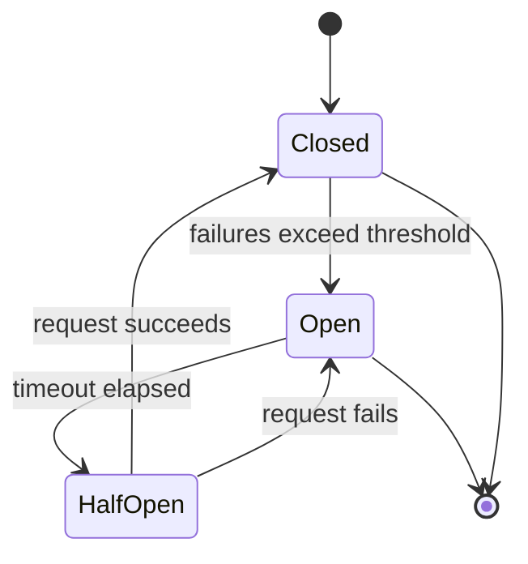
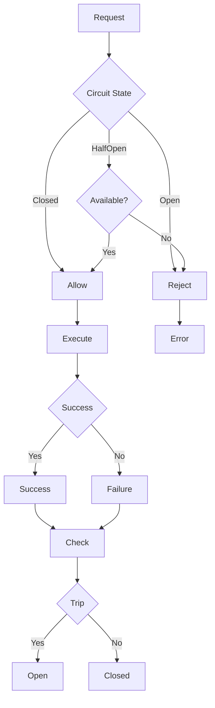

# protego

Lightweight, scalable circuit breaker for Go.

<details><summary>What is a circuit breaker?</summary>
A circuit breaker prevents your application from making calls to a service that is not working. When a service fails repeatedly, the circuit breaker *opens* and blocks new requests. After a short time, it allows a few requests through to test if the service has recovered. If the service is working again, the circuit breaker *closes* and normal operation continues.



</details>

For reference, please see [Circuit Breaker Pattern by Microsoft](https://learn.microsoft.com/en-us/azure/architecture/patterns/circuit-breaker), [Writing a circuit breaker in Go by Redowan](https://rednafi.com/go/circuit-breaker/) and [Circuit Breaker by Martin Fowler](https://martinfowler.com/bliki/CircuitBreaker.html)

## Installing protego

```bash
go get github.com/blairtcg/protego
```

## Quick start

```go
package main

import (
    "fmt"
    "github.com/blairtcg/protego"
)

func main() {
    cb := protego.New(protego.Config{
        Name:    "my-service",
        Timeout: 30 * time.Second,
    })

    err := cb.Execute(func() error {
        // call your service here
        return nil
    })
    if err != nil {
        fmt.Println("Request blocked:", err)
    }
}
```

## Config options

| Option               | Description                                         | Default                |
| -------------------- | --------------------------------------------------- | ---------------------- |
| Name                 | Identifier for the breaker                          | ""                     |
| MaxRequests          | Requests allowed in half-open state                 | 1                      |
| Interval             | Time before resetting counts in closed state        | 0                      |
| Timeout              | Time before transitioning to half-open              | 60s                    |
| ReadyToTrip          | Function that returns true when breaker should open | 6 consecutive failures |
| IsSuccessful         | Function that returns true for successful errors    | nil error              |
| OnStateChange        | Function called when state changes                  | nil                    |
| HalfOpenMaxQueueSize | Max queue size in half-open state                   | 0 (no queue)           |

## States

- **Closed**: Normal operation. Requests pass through.
- **Open**: Service is not working. Requests are rejected.
- **Half-open**: Testing if service has recovered. Limited requests allowed.

<details><summary>How it works</summary>
 

</details>

## Examples

See the `examples` folder for more use cases.

## Benchmark results

Tested on Intel Celeron N3060 1.60Ghz:

| Library                | ns/op |
| ---------------------- | ----- |
| Protego                | 65    |
| Sony/Gobreaker         | 388   |
| Rubyist/Circuitbreaker | 252   |

Tests run with `go test -bench=. -benchtime=1s -cpu=1`.

Please see the `benchmarks` folder for our benchmarking tests, if you have any suggestions on how to make this benchmark more accurate, feel free to open an issue/PR!

## Requirements

- Go 1.19 or later

## License

MIT
